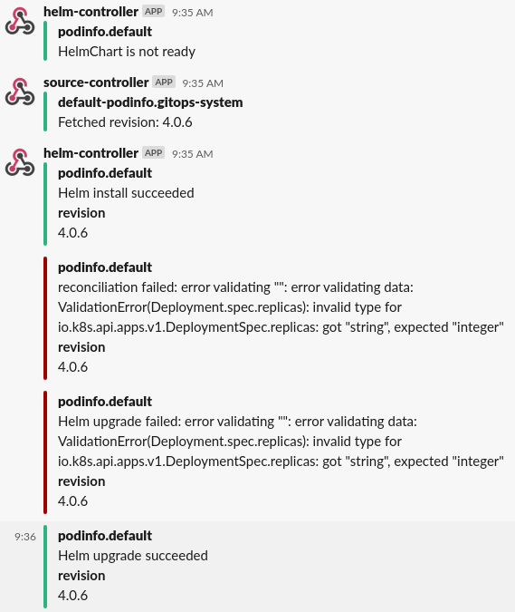

# Manage Helm releases

The [helm-controller](../components/helm/controller.md) allows you to
declaratively manage Helm chart releases with Kubernetes manifests.
It makes use of the artifacts produced by the
[source-controller](../components/source/controller.md) from
`HelmRepository` and `HelmChart` resources.
The helm-controller is part of the default toolkit installation.

## Prerequisites

To follow this guide you'll need a Kubernetes cluster with the GitOps 
toolkit controllers installed on it.
Please see the [get started guide](../get-started/index.md)
or the [install command docs](../cmd/tk_install.md).

## Define a Helm repository

To be able to deploy a Helm chart, the Helm chart repository has to be
known first to the source-controller, so that the `HelmRelease` can
reference to it.

A cluster administrator should register trusted sources by creating
`HelmRepository` resources in the `gitops-system` namespace.
By default, the source-controller watches for sources only in the
`gitops-system` namespace, this way cluster admins can prevent
untrusted sources from being registered by users.

```yaml
apiVersion: source.fluxcd.io/v1alpha1
kind: HelmRepository
metadata:
  name: podinfo
  namespace: gitops-system
spec:
  interval: 1m
  url: https://stefanprodan.github.io/podinfo
```

The `interval` defines at which interval the Helm repository index
is fetched, and should be at least `1m`. Setting this to a higher
value means newer chart versions will be detected at a slower pace,
a push-based fetch can be introduced using [webhook receivers](webhook-receivers.md)

The `url` can be any HTTP/S Helm repository URL.

!!! hint "Authentication"
    HTTP/S basic and TLS authentication can be configured for private
    Helm repositories. See the [`HelmRepository` CRD docs](../components/source/helmrepositories.md)
    for more details.

## Define a Helm release

With the `HelmRepository` created, define a new `HelmRelease` to deploy
the Helm chart from the repository:

```yaml
apiVersion: helm.fluxcd.io/v2alpha1
kind: HelmRelease
metadata:
  name: podinfo
  namespace: default
spec:
  interval: 5m
  chart:
    name: podinfo
    version: '^4.0.0'
    sourceRef:
      kind: HelmRepository
      name: podinfo
      namespace: gitops-system
    interval: 1m
  values:
    replicaCount: 2
```

The `chart.name` is the name of the chart as made available by the Helm
repository, and may not include any aliases.

The `chart.version` can be a fixed semver, or any semver range (i.e.
`>=4.0.0 <4.0.2`).

The `chart` values are used by the helm-controller as a template to
create a new `HelmChart` resource in the same namespace as the
`sourceRef`. The source-controller will then lookup the chart in the
artifact of the referenced `HelmRepository`, fetch the chart, and make
it available as a `HelmChart` artifact to be used by the
helm-controller.

!!! Note
    The `HelmRelease` offers an extensive set of configurable flags
    for finer grain control over how Helm actions are performed.
    See the [`HelmRelease` CRD docs](../components/helm/helmreleases.md)
    for more details.

## Receive notifications

The default toolkit installation configures the helm-controller to
broadcast events to the [notification-controller](../components/notification/controller.md).

To receive the events as notifications, a `Provider` needs to be setup
first as described in the [notifications guide](notifications.md#define-a-provider).
Once you have set up the `Provider`, create a new `Alert` resource in
the `gitops-system` to start receiving notifications about the Helm
release:

```yaml
apiVersion: notification.fluxcd.io/v1alpha1
  kind: Alert
  metadata:
    generation: 2
    name: helm-podinfo
    namespace: gitops-system
  spec:
    providerRef:
      name: slack
    eventSeverity: info
    eventSources:
    - kind: HelmRepository
      name: podinfo
    - kind: HelmChart
      name: default-podinfo
    - kind: HelmRelease
      name: podinfo
      namespace: default
```


